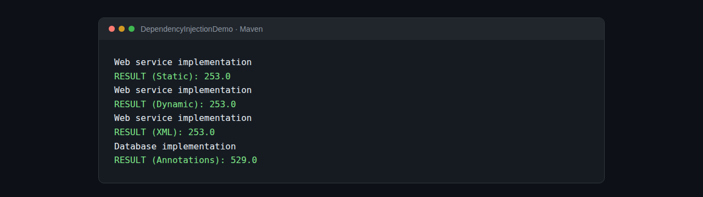

<div align="center">

# Dependency Injection Demo

### A small Java project for learning dependency injection with Spring

[](https://www.oracle.com/java/technologies/javase/jdk21-archive-downloads.html)
[](https://spring.io/projects/spring-framework)
[](LICENSE)

</div>

This is a small educational proof of concept built while getting familiar with Java and Spring. It uses one `IDao` interface and one `IMetier` service to compare four ways of assembling the same application.



## What I am learning

| Example | Wiring style | Where to look |
| --- | --- | --- |
| Static | Dependencies created directly in Java | `PresentationV1` |
| Dynamic | Classes loaded from `config.txt` with reflection | `PresentationV2` |
| Spring XML | Setter injection from `config.xml` | `PresAvecSpringXML` |
| Spring annotations | Component scanning and setter injection | `PresAvecSpringAnnotations` |

The data access implementations return different values so the result makes the selected dependency visible:

- `DaoImpl` represents a database implementation and returns `23`, producing `529`.
- `DaoImplV2` represents a web service implementation and returns `11`, producing `253`.

The business layer multiplies the DAO value by `23`. The same `IMetier` contract works with either implementation, which is the main idea behind loose coupling.

## Run it

You need Java 21 and Maven installed.

```bash
mvn clean compile
```

Run any example from the project root:

```bash
mvn exec:java -Dexec.mainClass=presentation.PresentationV1
mvn exec:java -Dexec.mainClass=presentation.PresentationV2
mvn exec:java -Dexec.mainClass=presentation.PresAvecSpringXML
mvn exec:java -Dexec.mainClass=presentation.PresAvecSpringAnnotations
```

The dynamic example reads the implementation class names from `config.txt`. The XML example reads its bean definitions from `src/main/resources/config.xml`. Try changing either configuration to see how the result changes without changing the business interface.

## Project structure

```text
src/main/java/
├── dao/          DAO contract and database implementation
├── ext/          Alternate web service implementation
├── metier/       Business contract and implementation
├── config/       Spring annotation configuration
└── presentation/ Four runnable examples
```

## License

This project is available under the [MIT License](LICENSE).
